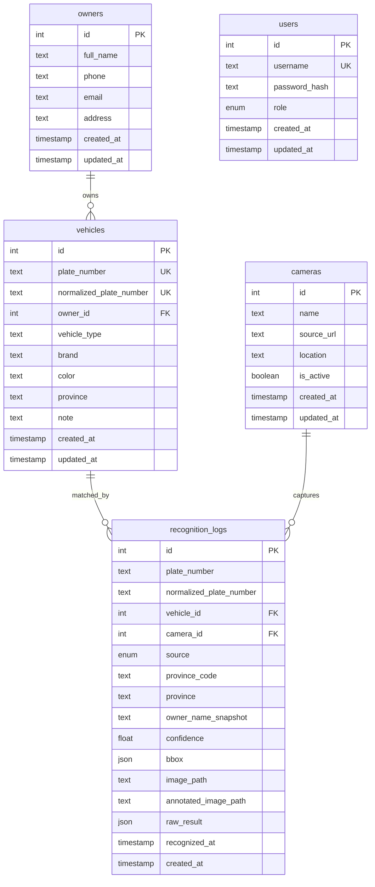

# PostgreSQL Design

Database for the license plate recognition system.

## Goals

- Store vehicle owners and registered vehicles.
- Store camera sources.
- Store every recognition event from upload/camera.
- Keep raw AI output for debugging and later model improvements.
- Match noisy OCR output to known vehicles using normalized plate numbers.

## ERD



## Tables

### users

Reserved for authentication and authorization.

Current roles:

- `ADMIN`
- `USER`

Authentication is not implemented yet, but the table is ready for the next
stage.

### owners

Stores vehicle owner information.

Important fields:

- `full_name`: owner display name.
- `phone`, `email`, `address`: optional contact information.

Relation:

- One owner can own many vehicles.

### vehicles

Stores registered vehicles.

Important fields:

- `plate_number`: human-readable plate number.
- `normalized_plate_number`: uppercase plate with non-alphanumeric characters
  removed. This is the matching key used by the backend.
- `owner_id`: optional owner relation.
- `province`: registered province/city if known.

Example:

```text
plate_number = 51F-123.45
normalized_plate_number = 51F12345
```

### cameras

Stores recognition sources.

Important fields:

- `name`: display name, e.g. `Gate 1`.
- `source_url`: camera URL or browser-source label.
- `location`: physical location.
- `is_active`: soft enable/disable flag.

### recognition_logs

Stores every AI recognition event.

Important fields:

- `plate_number`: raw OCR output.
- `normalized_plate_number`: normalized OCR output for search and matching.
- `vehicle_id`: linked vehicle if the normalized plate exists in `vehicles`.
- `camera_id`: source camera if available.
- `source`: `IMAGE_UPLOAD`, `CAMERA_FRAME`, or `CAMERA_STREAM`.
- `confidence`: combined YOLO/OCR confidence.
- `bbox`: detected box coordinates.
- `image_path`: original uploaded image.
- `annotated_image_path`: image with bounding box.
- `raw_result`: full AI result snapshot for debugging.

## Indexes

Current indexes:

- `vehicles.plate_number`
- `vehicles.normalized_plate_number`
- `recognition_logs.plate_number`
- `recognition_logs.normalized_plate_number`
- `recognition_logs.recognized_at`

These cover the expected queries:

- Search vehicle by plate.
- Match recognition result to a registered vehicle.
- List recognition history by time.
- Filter logs by plate number.

## Matching Rule

The backend stores two forms of plate text:

```text
Raw:        51F-123.45
Normalized: 51F12345
```

When the AI returns a recognition result, the backend:

1. Normalizes the OCR plate.
2. Searches `vehicles.normalized_plate_number`.
3. Links the recognition log to the vehicle if found.
4. Otherwise stores the log without `vehicle_id`.

## Open Decisions

Need user confirmation later:

- Whether one owner can have multiple phone numbers.
- Whether vehicles need statuses like `ACTIVE`, `BLOCKED`, `UNKNOWN`.
- Whether recognition logs should be retained forever or archived.
- Whether user login is required in the MVP frontend.
- Whether camera streams will be browser webcams only or IP/RTSP cameras too.
